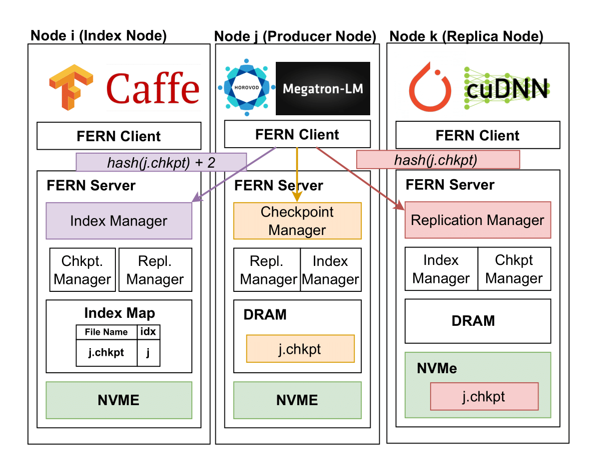
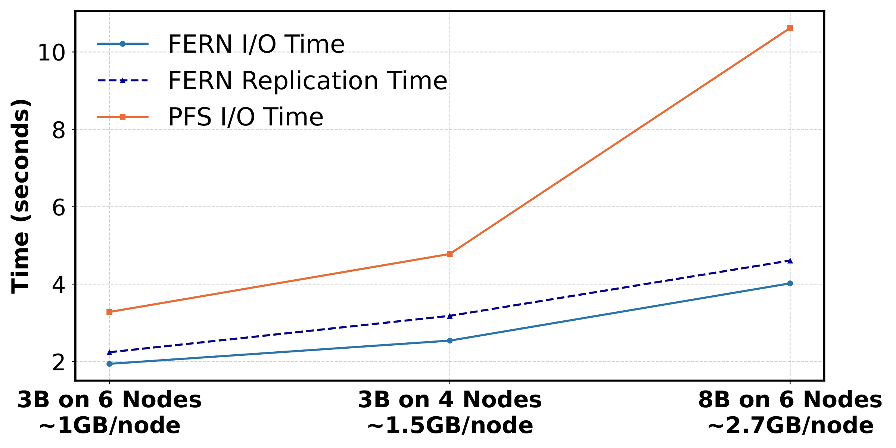

🌿 FERN: Fast, Efficient Replication-based Checkpointing System
FERN (Fast, Efficient ReplicatioN) is a high-performance, fault-tolerant checkpointing system designed for large-scale LLM training on HPC clusters. It extends HVAC (High Velocity AI Cache) into a write-capable, distributed key-value store to enable fast and resilient checkpointing without requiring changes to the training application.

📄 This implementation is based on the HotStorage’25 paper:
Checkpointing at Cache-Speed—Extending HVAC for Resilient LLM Training on HPC Systems
[DOI]

✨ Key Features
DRAM-first Write Buffering: Checkpoints are first written to /dev/shm, leveraging fast CPU memory for ultra-low-latency I/O.

Asynchronous NVMe Replication: Data is replicated in the background to a neighboring node’s NVMe storage for fault resilience.

Transparent I/O Interception: Uses LD_PRELOAD to interpose on file I/O calls without modifying application code.

Deterministic Placement Strategy: Index and replica nodes are selected via hashing for load balancing and high availability.

Optional PFS Flush: Checkpoints can be flushed asynchronously to the parallel file system for long-term persistence.

🏗️ System Architecture
FERN consists of two main components:

FERN Client: Intercepts file I/O and redirects checkpoint writes.

FERN Server: Runs on each node and consists of:

Checkpoint Manager: Buffers data in DRAM.

Replication Manager: Handles NVMe replication.

Index Manager: Maintains checkpoint metadata.

Figure: FERN system architecture

📊 Performance Highlights
Up to 62% reduction in I/O time compared to PFS

Linear scalability with model size and number of nodes

Shortened checkpoint vulnerability window via fast replication

No application modifications required

